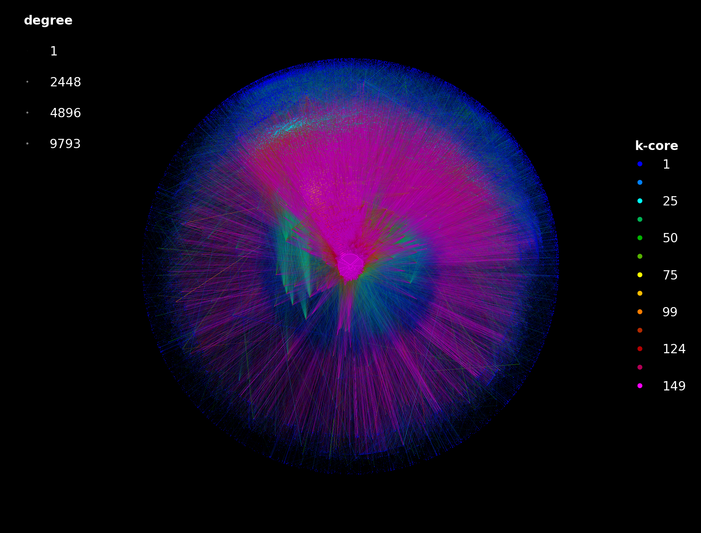
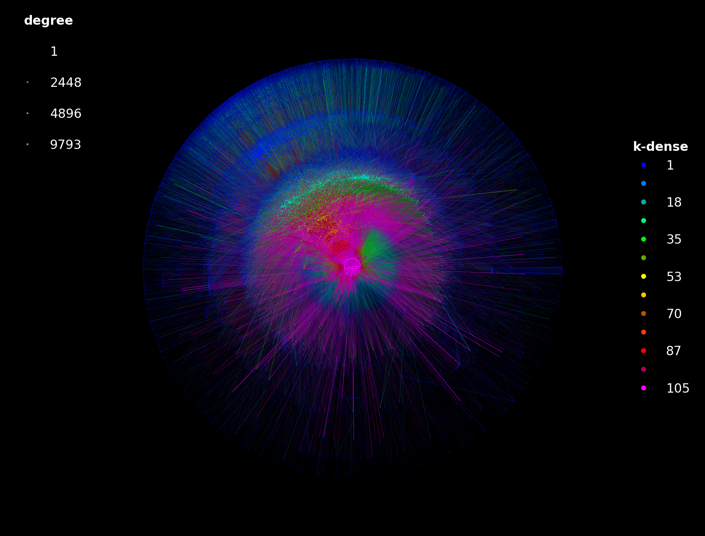

# 🧅 LaNet-vi

[](https://www.python.org/downloads/)
[](https://pypi.org/project/lanet-vi/)
[](LICENSE)
[](https://github.com/CoNexDat/LaNet-vi/actions/workflows/ci.yml)
[](https://conexdat.github.io/LaNet-vi/)
[](https://github.com/pre-commit/pre-commit)
[](https://github.com/astral-sh/ruff)
[](https://github.com/astral-sh/uv)

**Large-scale network visualization by k-core decomposition**

LaNet-vi draws large networks so that their structure is readable at a glance: nodes are
placed in concentric rings by their k-core (or k-dense, or d-core) index, the densest core
at the center, with node size following the degree and colors following the index. It is
the Python version of the C++ LaNet-vi that produced the well-known Internet AS-level maps
(Alvarez-Hamelin, Dall'Asta, Barrat & Vespignani, NIPS 2005; Beiró, Alvarez-Hamelin &
Busch, New J. Phys. 2008), and since 5.1.0 it follows the original algorithms.

<p align="center">
  
  
  <br>
  <em>The Internet at the AS level (CAIDA AS relationships, October 2025: 78,370 ASes,
  489,407 links). Left: k-cores 1–149, Tier-1 and hypergiant networks in the red core.
  Right: k-denses (m-cores), the triangle-based decomposition.</em>
</p>

## ✨ Features

- 🧅 **K-core**, **k-dense (m-core)** and **d-core** decompositions, weighted k-cores by
  strength intervals, all as in the C++ LaNet-vi
- 🎯 **The LaNet-vi placement**: nested components, rings by index, top-core cliques,
  and the `pow`/`log` circle packing of disconnected cores
- 🎨 **The LaNet-vi look**: rainbow or grayscale color scale, gradient edges, seeded edge
  sampling, index and degree legends, `--window` zoom, PNG/PDF/SVG output
- 🔗 **K-connectivity** of the shells (`--kconn`), the analysis of Beiró, Alvarez-Hamelin
  & Busch (2008), as in the C++ tool
- 📂 **Plain edge lists** (optionally weighted, directed, compressed) and CAIDA
  AS-relationship snapshots
- 🐍 **CLI and Python API** with the same settings, also as a YAML file
- ⚙️ Tested on Python 3.10–3.13; the 78k-node AS graph renders in about a minute

## 📦 Installation

```bash
pip install lanet-vi
```

(or `uv pip install lanet-vi`). Python 3.10 or newer.

## 🚀 Quick Start

```bash
lanet-vi visualize --input network.txt --output network.png
```

```python
import networkx as nx
from lanet_vi import LaNetConfig, Network

net = Network(nx.karate_club_graph(), LaNetConfig())
net.decompose()
net.visualize("karate.png")
```

The input is an edge list, one `source target [weight]` per line (`#` comments,
`.gz`/`.bz2` accepted):

```
0 1
1 2 2.5
2 0
```

### The Internet topology

```python
from lanet_vi import LaNetConfig, Network
from lanet_vi.io.readers import read_caida_snapshot

graph, _ = read_caida_snapshot(
    "https://publicdata.caida.org/datasets/as-relationships/serial-1/20251001.as-rel.txt.bz2"
)
net = Network(graph, LaNetConfig())
net.decompose()
net.visualize("internet.png")
```

[`examples/`](examples/) has the full scripts behind the pictures above.

## ⚙️ Common Options

- `--decomp kcores|kdenses|dcores` — the decomposition (`dcores` needs `--directed`)
- `--weighted` — the third column is a weight: strength-based cores
- `--edges-percent 0.1` — fraction of edges drawn (default 0.5, never below `--min-edges`)
- `--background white` — or `black` (default); `--color-scheme col|bw|bwi`
- `--width 3200 --height 2400` — any size and aspect ratio
- `--window 0.25 0.75 0.25 0.75` — zoom: the central half of the picture at full size
- `--coord-distribution pow` — circle packing of disconnected cores (default: `classic` rings)
- `--seed 42` — reproducible layout and edge sample
- `--detect-communities` — Louvain communities colored and outlined on the picture (a 5.x addition)
- `--cores-file cores.csv` — also write the decomposition (CSV, or JSON by extension)
- `--config settings.yaml` — settings from a file; explicit flags override it

`lanet-vi config settings.yaml` writes a template with every setting and its default;
`lanet-vi info network.txt` prints the network statistics; `lanet-vi generate` makes
random graphs to try things on.

## 📖 Documentation

The full documentation is at **<https://conexdat.github.io/LaNet-vi/>** (the same pages
as `docs/`, with search and an API reference generated from the docstrings):

- **[Usage guide](docs/usage.md)** — every CLI option, the configuration file, the Python API
- **[Visualization guide](docs/visualization.md)** — how the picture is built: placement, colors, sizes, edges, legends
- **[Concepts](docs/concepts.md)** — k-cores, weighted k-cores, k-denses, k-connectivity, d-cores
- **[Coming from the C++ LaNet-vi](docs/cpp-migration.md)** — flag translation and what differs
- **[Examples](examples/)** — the CAIDA scripts

## 🛠️ Development

```bash
git clone https://github.com/CoNexDat/LaNet-vi.git
cd LaNet-vi
uv sync --all-extras
uv run pre-commit install
uv run pytest
```

## Contributing

Contributions are welcome. `main` is protected: open a pull request and iterate until CI
and the automatic Copilot review are green. See [CONTRIBUTING.md](CONTRIBUTING.md) for the
full workflow, coding conventions and release process, and [SECURITY.md](SECURITY.md) for
reporting vulnerabilities.

## Citation

If you use LaNet-vi in your research, please cite the software (GitHub's *Cite this
repository* button uses [`CITATION.cff`](CITATION.cff)) and the papers behind the method:

- Alvarez-Hamelin, J.I., Dall'Asta, L., Barrat, A., Vespignani, A. (2006). "Large scale networks fingerprinting and visualization using the k-core decomposition". *Advances in Neural Information Processing Systems 18*.

- Beiró, M.G., Alvarez-Hamelin, J.I., Busch, J.R. (2008). "A low complexity visualization tool that helps to perform complex systems analysis". *New Journal of Physics*.

## 🏛️ Heritage

LaNet-vi 5.x is a from-scratch Python rewrite of the original **LaNet-vi** (Large Network
visualization tool), a C++ program developed since 2005 by Mariano G. Beiró and J. Ignacio
Alvarez-Hamelin (Universidad de Buenos Aires / CONICET) together with Alain Barrat, Luca
Dall'Asta and Alessandro Vespignani. The C++ tool introduced the concentric k-core layout
this package is built on and produced, among others, the Internet AS-level maps that made
the method known.

- Original releases (1.x to 3.0.1, last one in January 2016) are published on SourceForge:
  <https://sourceforge.net/projects/lanet-vi/> under the Academic Free License 3.0.
- Original project homepage: <http://lanet-vi.fi.uba.ar/>.
- The C++ sources are **not** part of this repository or of the PyPI package; they remain
  available at the links above.

## License

The Python implementation is released under the [MIT License](LICENSE), with the original
authors of the C++ version as co-holders of the copyright. The original C++ LaNet-vi remains
available under the Academic Free License 3.0 on SourceForge.

## Authors

- Esteban Carisimo (Python implementation)
- Mariano G. Beiró (original C++ version)
- J. Ignacio Alvarez-Hamelin (original C++ version)
